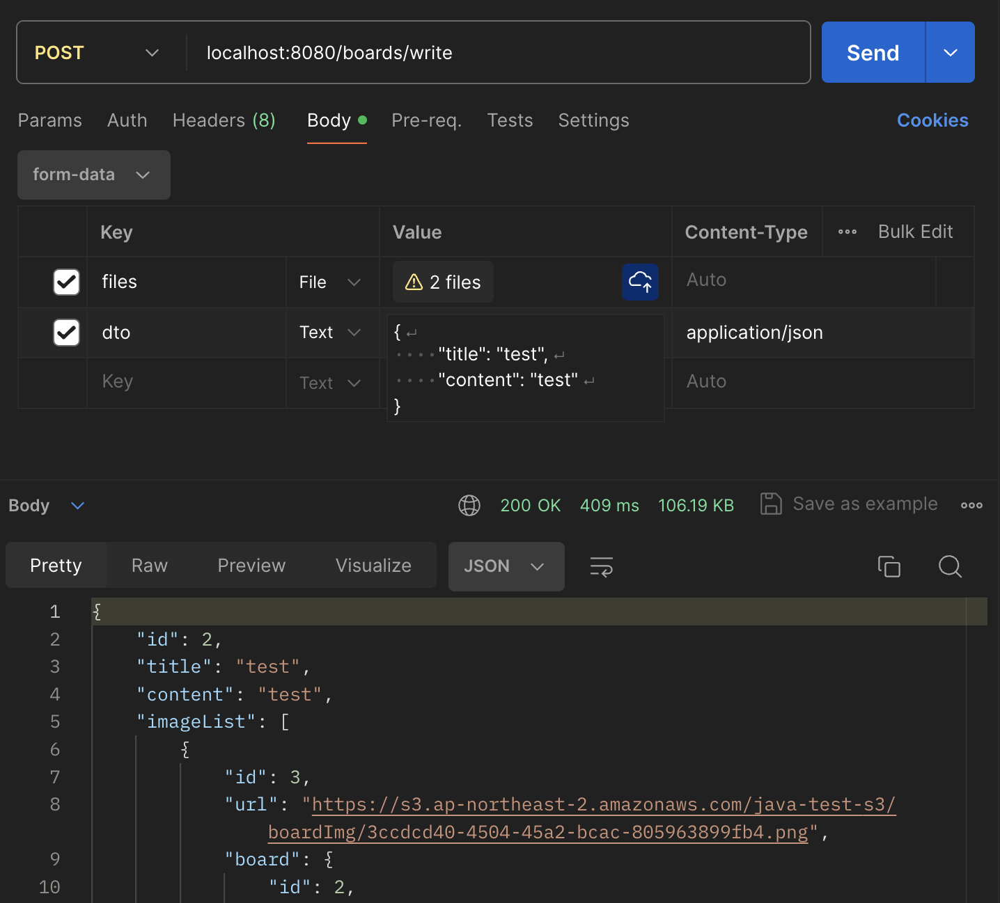
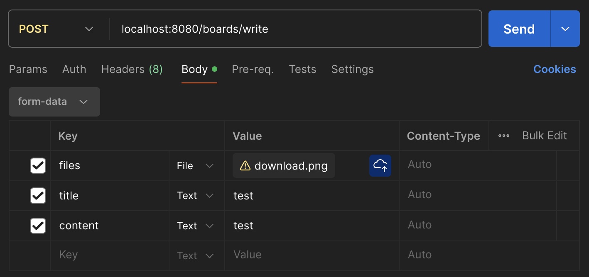

# AWS S3 

- 2024.03.25

AWS S3 버킷에 이미지 업로드, 리사이징, 삭제를 연습하기 위해 만든 프로젝트다.

---

## 스팩

- Spring Boot 3.2.4
- Spring Web
- Spring Data Jpa
- SQLite
- AWS S3 2.2.6
- Lombok
- Marvin

---

## Key Point

1. `@RequestPart` 어노테이션 사용법 & imgUpload() 메서드  
[S3ImageController](/src/main/java/com/example/S3_prac/s3/S3ImageController.java)
```java
  @PostMapping("/image")
  public ResponseEntity<String> imgUpload(
    @RequestBody List<MultipartFile> files,
    @RequestPart RequestDto dto
    ) {
    log.info("title: {}", dto.getTitle());
    log.info("content: {}", dto.getContent());

    List<String> lists = s3FileService.uploadIntoS3("/boardImg", files);
    
    return ResponseEntity.ok(lists.get(0));
  }
}
```
@RequestPart 어노테이션을 사용한다면 Postman에서 다르게 데이터를 넣어줘야 한다.  
Body에서 form-data로 바꾸고 files - ${이미지 넣을 파일들}까진 동일하다.  
그 다음, dto가 필요하다면 한 칸에 해당 dto의 모든 데이터를 넣어줘야 한다.  
즉, value에 JSON 형태로 넣어줘야 한다.  



2. `@RequestParam` + `@ModelAttribute` & imgUpload() 메서드
```java
  @PostMapping("/image")
  public ResponseEntity<String> imgUpload(
    @RequestParam("files") List<MultipartFile> files,
    @ModelAttribute RequestDto dto
    ) {
    log.info("title: {}", dto.getTitle());
    log.info("content: {}", dto.getContent());

    List<String> lists = s3FileService.uploadIntoS3("/boardImg", files);
    
    return ResponseEntity.ok(lists.get(0));
  }
}
```
@Requestparam과 @ModelAttribute로 이미지 업로드를 하게 된다면   
Body에서 form-data로 바꾼 다음 files와 dto의 필드들을 넣어주면 된다.  



3. 연관관계 편의 메서드  
[Board.java](/src/main/java/com/example/S3_prac/entity/Board.java)
```java
  public void addImage(Image image) {
    // 현재 Board 인스턴스에 Image 객체를 추가
    this.imageList.add(image);
    // Image 객체의 Board 참조를 현재 Board 인스턴스로 설정
    image.setBoard(this);
  }
```
연관관계 편의 메서드(convenience method)는 양방향 관계에서   
한 쪽의 Entity를 변경할 때, 반대편 Entity에도 자동으로 변경을 반영하기 위해 사용된다.  
이는 데이터의 일관성을 유지하고, 코드의 중복을 줄이며,   
Entity 간의 관계를 설정을 더 명확하게 표현하기 위한 목적으로 사용된다.

---

## 그 외 
[Trouble Shooting](TroubleShooting.md)